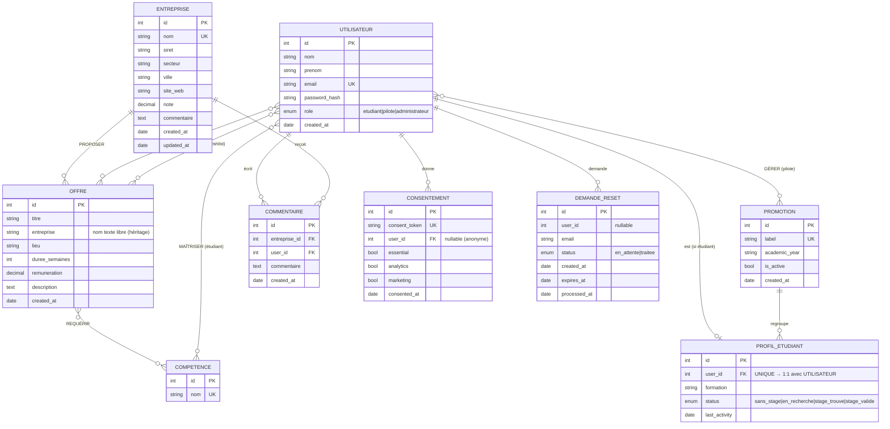

# MCD — Help Me Stage

Modèle Conceptuel de Données reconstruit à partir de la base de données Railway
(14 tables relationnelles → 7 entités + associations en notation Merise).

## Diagramme (vue entités-relations)

> Notation « patte d'oie » (Mermaid). Les tables de liaison pures
> (`offre_competence`, `student_competence`, `pilot_promotions`, `student_wishlist`)
> deviennent des **associations N:N** au niveau conceptuel.

## Associations et cardinalités (Merise)

| Association | Entité A | (min,max) | (min,max) | Entité B | Attributs portés |
|-------------|----------|-----------|-----------|----------|------------------|
| APPARTENIR  | ÉTUDIANT | (0,1) | (0,N) | PROMOTION | — |
| GÉRER       | PILOTE   | (0,N) | (0,N) | PROMOTION | created_at |
| PROPOSER    | ENTREPRISE | (0,N) | (0,1) | OFFRE | — |
| REQUÉRIR    | OFFRE    | (0,N) | (0,N) | COMPÉTENCE | — |
| MAÎTRISER   | ÉTUDIANT | (0,N) | (0,N) | COMPÉTENCE | — |
| POSTULER    | ÉTUDIANT | (0,N) | (0,N) | OFFRE | status, lettre_motivation, cv_filename, created_at |
| SOUHAITER   | ÉTUDIANT | (0,N) | (0,N) | OFFRE | created_at |
| COMMENTER   | UTILISATEUR | (0,N) | (0,N) | ENTREPRISE | commentaire, created_at |
| CONSENTIR   | UTILISATEUR | (0,N) | (0,1) | CONSENTEMENT | — |
| DEMANDER    | UTILISATEUR | (0,N) | (0,1) | DEMANDE_RESET | — |

## Correspondance tables ↔ concepts

| Table SQL | Rôle dans le MCD |
|-----------|------------------|
| `users` | Entité **UTILISATEUR** (super-type) |
| `student_profiles` | Spécialisation **ÉTUDIANT** (1:1 avec UTILISATEUR) |
| `promotions` | Entité **PROMOTION** |
| `entreprises` | Entité **ENTREPRISE** |
| `offres` | Entité **OFFRE** |
| `competences` | Entité **COMPÉTENCE** |
| `cookie_consents` | Entité **CONSENTEMENT** |
| `password_reset_requests` | Entité **DEMANDE_RESET** |
| `pilot_promotions` | Association **GÉRER** (N:N) |
| `student_profiles.promotion_id` | Association **APPARTENIR** |
| `offres.entreprise_id` | Association **PROPOSER** |
| `offre_competence` | Association **REQUÉRIR** (N:N) |
| `student_competence` | Association **MAÎTRISER** (N:N) |
| `candidatures` | Association **POSTULER** (N:N porteuse de données) |
| `student_wishlist` | Association **SOUHAITER** (N:N) |
| `entreprise_commentaires` | Association/Entité **COMMENTER** |

## Notes de modélisation

- **UTILISATEUR / ÉTUDIANT** : `student_profiles` ne concerne que les étudiants.
  C'est une **spécialisation** (héritage) : les pilotes et admins n'ont pas de profil.
  Le discriminant est le champ `role`.
- **OFFRE.entreprise** (texte libre) coexiste avec `entreprise_id` : héritage du modèle
  initial. Conceptuellement, seule l'association PROPOSER vers ENTREPRISE compte.
- **COMMENTER** : la table `entreprise_commentaires` a une clé primaire propre (`id`)
  et autorise plusieurs commentaires d'un même utilisateur sur une même entreprise.
  En toute rigueur Merise, c'est donc une **entité COMMENTAIRE** plutôt qu'une simple
  association N:N (dont le couple devrait être unique).
- **CONSENTEMENT** et **DEMANDE_RESET** ont un `user_id` *nullable* : ils peuvent exister
  sans utilisateur rattaché (consentement anonyme, demande par email seul).
