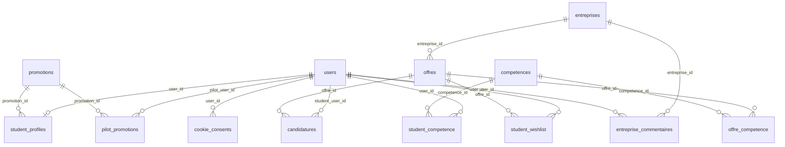

# MLD — Help Me Stage

Modèle Logique de Données dérivé du [MCD](MCD.md), conforme à la base Railway (14 tables).

**Convention de notation :**
- <ins>Clé primaire</ins> = soulignée
- `#cle` = clé étrangère (référence vers une autre table)
- *(U)* = contrainte d'unicité · *(N)* = valeur NULL autorisée

---

## Tables issues des entités

**users** (<ins>id</ins>, nom, prenom, email *(U)*, password_hash, role, created_at)

**promotions** (<ins>id</ins>, label *(U)*, academic_year, is_active, created_at)

**entreprises** (<ins>id</ins>, nom *(U)*, siret *(N)*, secteur *(N)*, ville *(N)*, site_web *(N)*, note *(N)*, commentaire *(N)*, created_at, updated_at)

**competences** (<ins>id</ins>, nom *(U)*)

**offres** (<ins>id</ins>, titre, `#entreprise_id` *(N)*, entreprise, lieu *(N)*, duree_semaines *(N)*, remuneration *(N)*, description *(N)*, created_at)
&nbsp;&nbsp;↳ `#entreprise_id` → entreprises(id)

**student_profiles** (<ins>id</ins>, `#user_id` *(U)*, formation, `#promotion_id` *(N)*, status, last_activity *(N)*)
&nbsp;&nbsp;↳ `#user_id` → users(id) · `#promotion_id` → promotions(id)
&nbsp;&nbsp;*(la spécialisation ÉTUDIANT : 1 ligne par étudiant, user_id UNIQUE = relation 1:1)*

**cookie_consents** (<ins>id</ins>, consent_token *(U)*, `#user_id` *(N)*, essential, analytics, marketing, consented_at, created_at, updated_at)
&nbsp;&nbsp;↳ `#user_id` → users(id)

**password_reset_requests** (<ins>id</ins>, user_id *(N)*, email, status, created_at, expires_at *(N)*, processed_at *(N)*)
&nbsp;&nbsp;*(user_id sans contrainte FK stricte : lien souple, demande possible par email seul)*

---

## Tables issues des associations

### Associations N:N → table avec clé primaire composée

**pilot_promotions** (<ins>#pilot_user_id, #promotion_id</ins>, created_at) — assoc. *GÉRER*
&nbsp;&nbsp;↳ `#pilot_user_id` → users(id) · `#promotion_id` → promotions(id)

**offre_competence** (<ins>#offre_id, #competence_id</ins>) — assoc. *REQUÉRIR*
&nbsp;&nbsp;↳ `#offre_id` → offres(id) · `#competence_id` → competences(id)

**student_competence** (<ins>#user_id, #competence_id</ins>) — assoc. *MAÎTRISER*
&nbsp;&nbsp;↳ `#user_id` → users(id) · `#competence_id` → competences(id)

**student_wishlist** (<ins>#user_id, #offre_id</ins>, created_at) — assoc. *SOUHAITER*
&nbsp;&nbsp;↳ `#user_id` → users(id) · `#offre_id` → offres(id)

### Associations porteuses de données → table avec clé primaire propre

**candidatures** (<ins>id</ins>, `#student_user_id`, `#offre_id`, status, lettre_motivation *(N)*, cv_filename *(N)*, created_at) — assoc. *POSTULER*
&nbsp;&nbsp;↳ `#student_user_id` → users(id) · `#offre_id` → offres(id)

**entreprise_commentaires** (<ins>id</ins>, `#entreprise_id`, `#user_id` *(N)*, commentaire, created_at) — assoc. *COMMENTER*
&nbsp;&nbsp;↳ `#entreprise_id` → entreprises(id) · `#user_id` → users(id)

---

## Règles de passage MCD → MLD appliquées

| Élément du MCD | Règle | Résultat dans le MLD |
|----------------|-------|----------------------|
| Entité | → 1 table, l'identifiant devient clé primaire | users, promotions, offres… |
| Association **1:N** (ex. PROPOSER) | → clé étrangère côté « N » | `offres.entreprise_id` |
| Association **0,1 / 0,N** (APPARTENIR) | → clé étrangère *(N)* côté « N » | `student_profiles.promotion_id` |
| Association **N:N** (REQUÉRIR, MAÎTRISER, GÉRER, SOUHAITER) | → table de jointure, PK = (FK_A, FK_B) | offre_competence, student_competence… |
| Association **N:N porteuse de données** (POSTULER) | → table avec PK propre + les 2 FK + attributs | candidatures |
| **Héritage** ÉTUDIANT | → table dédiée reliée 1:1 (user_id UNIQUE) | student_profiles |

---

## Diagramme relationnel (clés étrangères)

